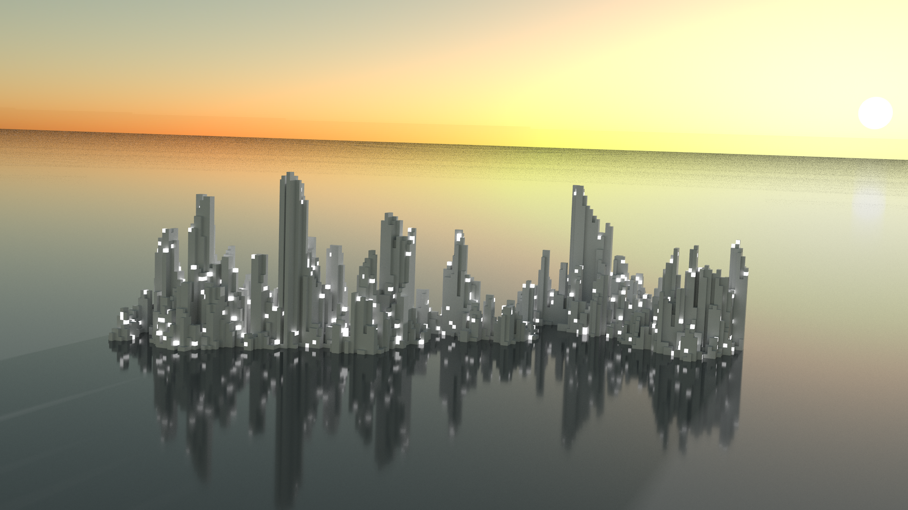
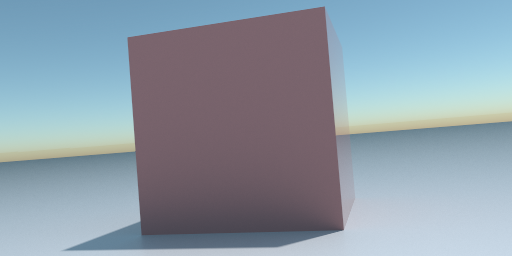
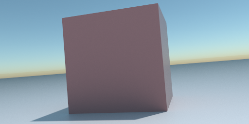
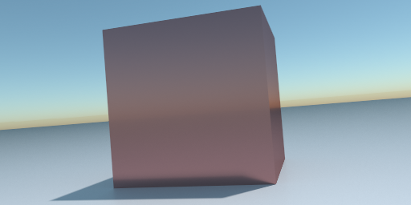
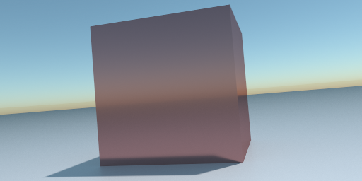

# Vixel

A javascript & webgl voxel path tracer. See it live [here](https://wwwtyro.github.io/vixel).

## Materials

Vixel currently describes materials in terms of their _metalness_ and their _roughness_.

| Roughness | Metalness | Real world analogue | Rendered example                 |
| --------- | --------- | ------------------- | -------------------------------- |
| 0.0       | 0.0       | Smooth plastic      |  |
| 1.0       | 0.0       | Chalk               |  |
| 0.0       | 1.0       | Mirror              |  |
| 1.0       | 0.05      | Unpolished metal    |  |

## FAQ

**The image is converging very slowly. How can I speed it up?**

Increase Samples/Frame. This is limited - if you become GPU bound (interaction becomes slow and choppy), increasing this value will not increase the convergence
speed.

**Interaction is slow or choppy. How can I make it smoother?**

Decrease Samples/Frame.

**I see some weird artifacts. How can I fix them?**

You may have found a bug. Post an issue with a screenshot and the copied URL and I'll see what can be done about it.
